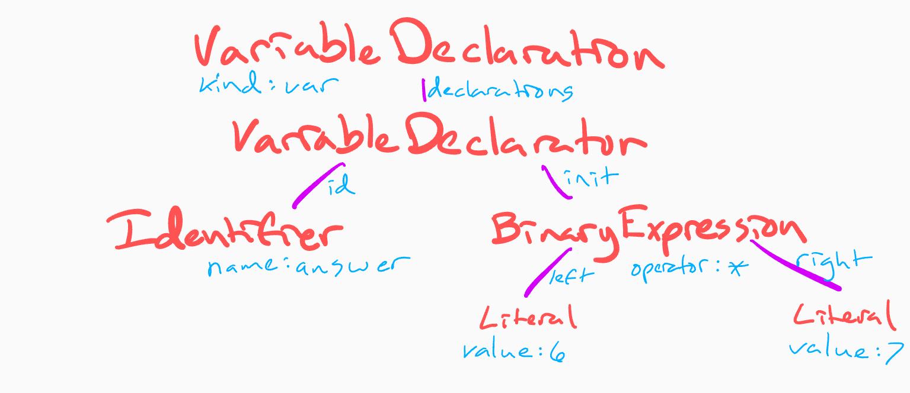

# ASTs Are Awesome

## Background

We have some really great tools in JavaScript land, and there is a magic data structure underpinning them all. It also so happens that this data structure is the key to unlocking our own improvements to our developer experience.

## Compilers!

The Super Tiny Compiler project has a really wonderful explanation of compilers to give us context.

> Most compilers break down into three primary stages: Parsing, Transformation, and Code Generation
>
> 1. _Parsing_ is taking raw code and turning it into a more abstract
>    representation of the code.
>
> 2. _Transformation_ takes this abstract representation and manipulates to do
>    whatever the compiler wants it to.
>
> 3. _Code Generation_ takes the transformed representation of the code and
>    turns it into new code.
>    From: [jamiebuilds/the-super-tiny-compiler](https://github.com/jamiebuilds/the-super-tiny-compiler/blob/master/the-super-tiny-compiler.js#L103)

### Babel

Babel is a special kind of compiler, a source-to-source compiler, also known as a "transpiler." We can see each of the three primary stages in action.

1. Babel takes in JavaScript and handles the _parsing_ for us, handling JavaScript that uses recent features (think ES2018).
2. It _transforms_ the abstract representation, turning it into a representation that uses a more basic set of features.
3. It _generates_ JavaScript from the transformed representation, outputing code that is more widely understood by all browsers (think ES5).

We generally don't need to worry about how Parsing or Code Generation is handled beyond this. The coolest part of the process is the Transformation, and what we use as a "more abstract representation of the code."

Read [The Super Tiny Compiler](https://github.com/jamiebuilds/the-super-tiny-compiler) by [@jamiebuilds](https://twitter.com/jamiebuilds) for more background on what a compiler does. For now, let's focus on...

## Introducing the AST

The magic data structure that powers our favorite JavaScript tooling is the *A*bstract *S*yntax *T*ree. The AST is just a tree, and like other trees (the DOM, component hierarchy in React/Angular/Vue/etc), it starts with a root node. This node can have any number of children (0 or more) and those children can in turn have their own children.

Each node in the tree has three types of properties.

1. It always has a node type, like `Program` or `Identifier`.
2. It may have one or more properites its children can live. It may be a fixed property with one value, or a collection-oriented property with 0 or more children in an array.
3. It may have any number of descriptive properties that describe the node.

#### An Example

Let's consider the following code:

```javascript
var answer = 6 * 7;
```

This code is first broken down into an ordered collection of tokens: discrete elements of code that are like atoms in a molecule.

```javascript
["var", "answer", "=", "6", "*", "7"];
```

While we might associate a type with each of these tokens, we need a way to relate them to one another. Sequential order cannot give us a semantic understanding of how each token is connected.

We can think of these tokens in the form of a tree:



The nodes are represented here by their type, in red: `VariableDeclaration`, `VariableDeclarator`, `Identifier`, `BinaryExpression`, and `Literal`. These are all on the node as a `type` property.

The purple lines represent a parent-child relationship. The property where the child is referenced is in blue next to the line: `declarations`, `id`, `init`, `left`, and `right`.

The other blue text with colons are the descriptive properties for the node above them: `kind: "var"` on the `VariableDeclaration`, `name: "answer"` on the `Identifier`, `operator: "*"` on the `BinaryExpression`, and `value: 6` and `value: 7` on the `Literal`s.

### Explore in ASTExplorer.net

[AST Explorer](https://astexplorer.net/) is a web-based tool by [@fkling42](https://twitter.com/fkling42). It is the best way to explore ASTs and even play with writing our own linting rules, Babel transforms, or code mods.

// TODO: link to other sections from the above sentence

You can see everything above in a blank "program" in [AST Explorer](https://astexplorer.net/). Empty out the source code, then start exploring! Type out a `var`, a `function`, an `if` statement. See what happens when you change the `var` to a `const`. Explore.

We'll come back to AST Explorer A LOT.

## Traversal and Visitors

The next bit of magic is how we process the tree. Our favorite tools all handle walking the tree for us, and we can _opt in_ to handling each node using the "visitor pattern." If we care about a node of a certain type, we define a function for that node to be passed into. Each tool walks the tree, and for each node, the node is passed into any of the registered functions that care about that node's type.

Most plugins care about one node type, but some subscribe to multiple types, each with their own function.

## Static Analysis, AKA Linting

Linters are a fantastic way to get started. It's all about looking at nodes in a tree, and identifying patterns.

ESLint was the first JS linter to make this all about detecting AST patterns with a plugin system. Each ESLint rule is its own plugin. One of my favorite examples is the nested ternary rule.

// TODO: add nested ternary example

https://eslint.org/docs/developer-guide/working-with-rules

## Babel

Babel is a compiler that translates any recent version of JS (ES2018) into an older version of JS (ES5) that most browsers understand without polyfills. It is powered by dozens of plugins that each handle a specific type of translation, transforming specific nodes for specific purposes.

James Kyle wrote an awesome handbook on Babel. Specifically, check out the Babel Plugin Handbook, and read the Intro section: https://github.com/jamiebuilds/babel-handbook/blob/master/translations/en/plugin-handbook.md

### Example

If you like to dive into an example, check out the Babel plugin for [transform-shorthand-properties](https://github.com/babel/babel/tree/master/packages/babel-plugin-transform-shorthand-properties).

This transform changes this:
`var coords = { x };`

...into this:
`var coords = { x: x };`

The object shows up as a `ObjectProperty` node, and nodes of this type will have a `shorthand` property. The property's value is true when the shorthand is being used (`{ x }`), and false when it is unused (`{ x: x }`).

The key part of the transform code that does this looks like this.

```
export default declare(api => {
  return {
    visitor: {
      ObjectMethod(path) {
        /* ... */
      },

      ObjectProperty({ node }) {
        if (node.shorthand) {
          node.shorthand = false;
        }
      },
    },
  };
});
```

The `ObjectProperty` node type will have a `shorthand` property. This is true when the shorthand is being used (`{ x }`), and false when it is unused (`{ x: x }`).

### Write your own

Check out [Writing Your First Babel Plugin](https://github.com/jamiebuilds/babel-handbook/blob/master/translations/en/plugin-handbook.md#writing-your-first-babel-plugin).

## Code Mods

Code mods are a great tool for updating syntax that has changed. Maybe you are changing from library A to library B, and the API methods are named differently and their arguments need to be updated as well. This conversion process can be automated with code mods.

They are similar in approach to Babel plugins. You find a node, maybe check for a given pattern, then mutate the tree.

### JSCodeShift

One of the more popular code mod libraries adds some convenient APIs for mutating nodes in the tree.

### Example

// TODO: add example for Glamorous => Emotion
